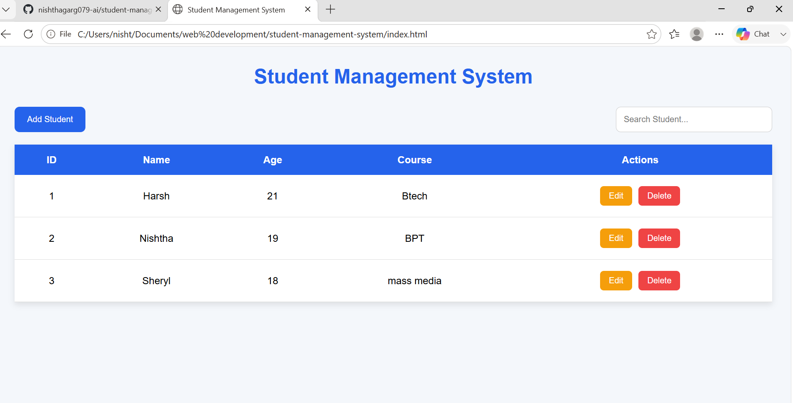
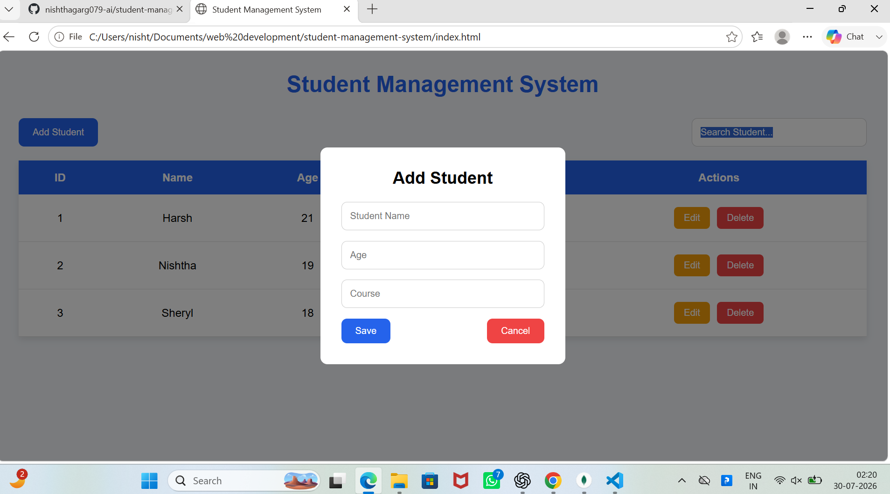
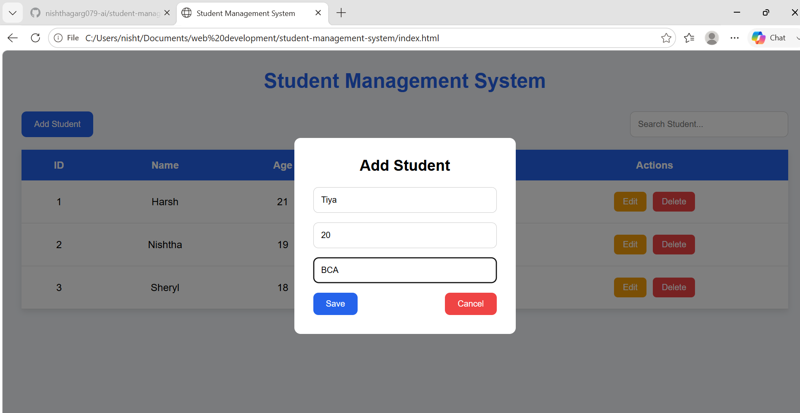
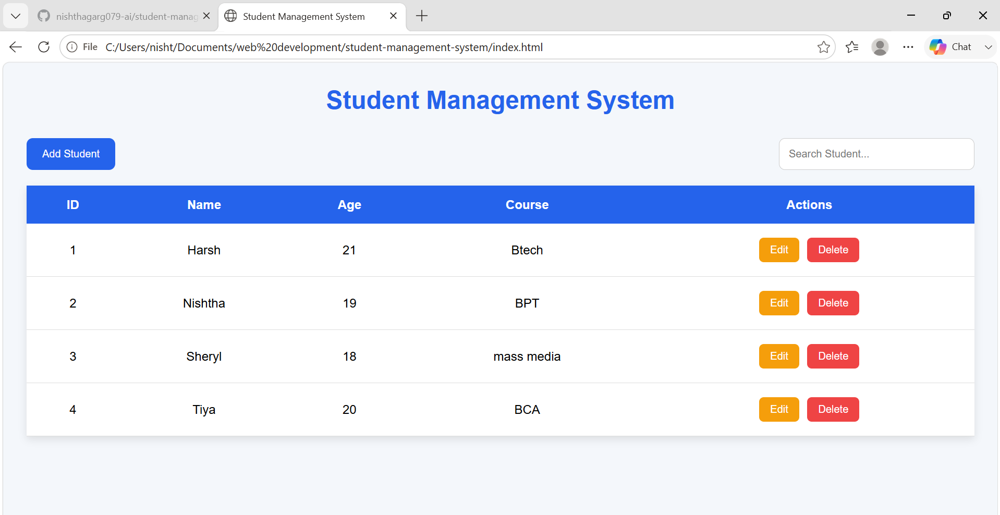

# 🎓 Student Management System

Full Stack Student Management System built with HTML, CSS, JavaScript, Node.js, Express.js, and MongoDB. Supports CRUD operations and REST API integration.

This project allows users to add, view, update, delete, and search student information with data stored permanently in MongoDB.

## 🌟 Project Preview



## ✨ Features

- Add new students
- View all students
- Edit student details
- Delete students
- Search students by name
- MongoDB database integration

## 🛠️ Technologies Used

- HTML5
- CSS3
- JavaScript
- Node.js
- Express.js
- MongoDB
- Mongoose

## 📂 Project Structure

```
student-management-system
│
├── backend/
│   ├── models/
│   ├── server.js
│   └── package.json
│
├── images/
├── index.html
├── style.css
├── script.js
└── README.md
```

## 📸 Screenshots

### 🏠 Home Page


### ➕ Add Student


### ✏️ Edit Student


### 🗄️ Database (MongoDB)


## 🔌 API Endpoints

| Method | Endpoint | Description |
|--------|----------|-------------|
| GET | `/students` | Get all students |
| POST | `/students` | Add a new student |
| PUT | `/students/:id` | Update student details |
| DELETE | `/students/:id` | Delete a student |


## 🚀 How To Run Locally

### 1. Clone the repository

```bash
git clone https://github.com/nishthagarg079-ai/student-management-system
```

### 2. Open the project

```bash
cd student-management-system
```

### 3. Install backend dependencies

```bash
cd backend
npm install
```

### 4. Start the backend server

```bash
node server.js
```

### 5. Open the frontend

Open `index.html` in your browser.

### 6. Make sure MongoDB is running locally

The application connects to MongoDB at:

```
mongodb://localhost:27017/studentDB
```

## 🔮 Future Improvements

- User authentication (Login/Signup)
- Upload student profile pictures
- Dashboard with student statistics
- Export student data as PDF or Excel
- Improve UI with animations and responsive design
- Deploy the application online

## 👩 Author

**Nishtha Garg**

Computer Science Student | Aspiring Full Stack Web Developer

GitHub: [nishthagarg079-ai](https://github.com/nishthagarg079-ai)

Built as a learning project while practicing Full Stack Web Development using HTML, CSS, JavaScript, Node.js, Express.js, MongoDB, and Mongoose.